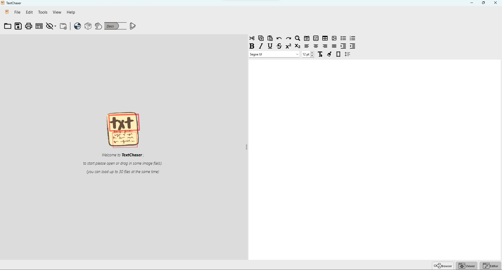

# TextChaser
TextChaser is a gui application for
*[Google Tesseract OCR Engine](https://github.com/tesseract-ocr/tesseract)*. In addition to that, it also uses a
pretrained *[EAST model](https://arxiv.org/abs/1704.03155v2)* for text detection from scene images and then inputs the
detected boxes to Tesseract for
image to text conversion. The gui part is developed with *[PySide6](https://doc.qt.io/qtforpython-6/)*.

⚠️ This work is from a 2019 job I took for an English-Farsi OCR
application and currently is being heavily refactored and changed
so that it can be used for other languages and include more OCR engines
and scene text detection models. It might not work out of
the box right now. When I remove this message it will be functional.

# License
TextChaser is licensed under Apache 2.0 License.

# Credits
+ Developed by Farzad Shayanfar